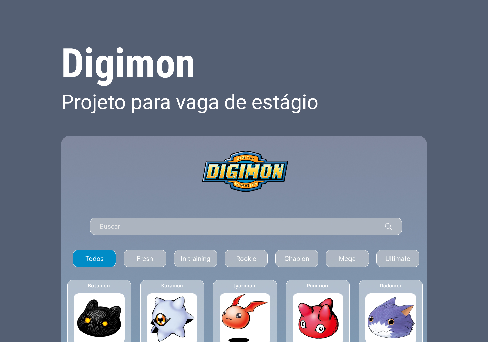

<h1 align="center"> Digimon Project </h1>

Projeto desenvolvido para a vaga de estágio front-end na <a href="https://globalfinanceiro.com.br/" target="_blank">Global Financeiro</a>.

  <a href="#-tecnologias">Tecnologias</a>&nbsp;&nbsp;&nbsp;|&nbsp;&nbsp;&nbsp;
  <a href="#-projeto">Projeto</a>&nbsp;&nbsp;&nbsp;|&nbsp;&nbsp;&nbsp;
  <a href="#-layout">Layout</a>&nbsp;&nbsp;&nbsp;

 

  

## 🚀 Tecnologias

Esse projeto foi desenvolvido com as seguintes tecnologias:

- HTML e CSS
- JavaScript
- Git e Github
- Figma

## 💻 Projeto

O projeto Digimon foi desenvolvido com objetivo de consumir a <a href="https://digimon-api.vercel.app">API de Digimon</a>. Utilizando JavaScript, o site exibe os Digimons com seus respectivos nomes e níveis. Inclui funcionalidades de busca por nome de Digimon e filtros por nível, proporcionando uma experiência de usuário intuitiva e eficiente.

- [Acesse o projeto finalizado, online](https://maykbrito.github.io/devlinks)

## 🔖 Layout

Você pode visualizar o layout do projeto através [DESSE LINK](https://www.figma.com/design/E5QRysbITnnjTnofg0RCts/Projeto-digimon?node-id=0-1). É necessário ter conta no [Figma](https://figma.com) para acessá-lo.

---

Feito com ♥ by Lívia O. Faria
